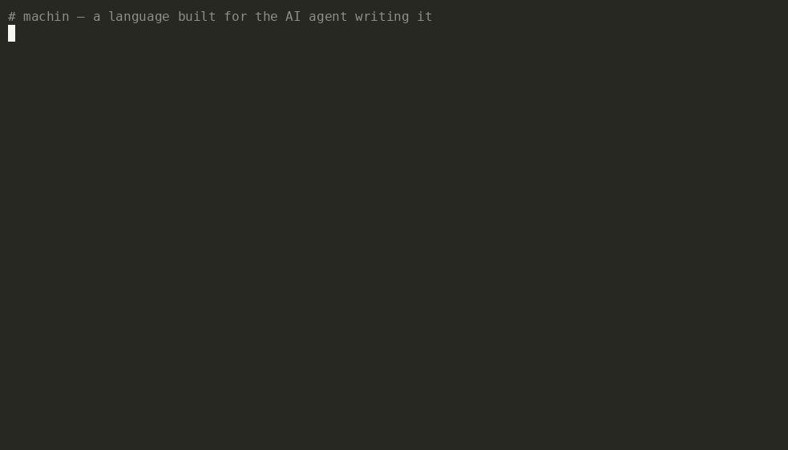

<p align="center">
  
  
  
  
  
</p>

# machin ⎯ Machine-First Language (MFL)

A language **shaped for AI agents to write and edit cheaply**: zero type annotations, one canonical declaration per line, every design choice measured for token cost. Compiles through C to a single native binary — C/Rust-class speed, unboxed values, no runtime.

[Spec](SPEC.md) · [Language tour](docs/LANGUAGE.md) · [Agent guide](AGENTS.md) · [Contributing](CONTRIBUTING.md) · [Ecosystem → **awesome-machin**](https://github.com/javimosch/awesome-machin) · [Landing](https://javimosch.github.io/machin/) · [Releases](https://github.com/javimosch/machin/releases)

> ### ▶ [Try machin in your browser → **play.intrane.fr**](https://play.intrane.fr)
> Write MFL, hit Run — it compiles to WebAssembly and runs client-side. No install.

> ### 🧬 machin is **written in machin** — a self-hosting compiler
> The whole toolchain — lexer, parser, type checker, C code generator, *and* `encode` /
> `build` / `run` — is written *in machin* ([`selfhost/`](selfhost/), ~4k lines). It
> compiles its own source back into itself, and the rebuild reproduces itself
> **byte-for-byte** — a genuine compiler **fixpoint** — at ~0.9× the original's speed. A
> language mature enough to build itself from scratch, verified to the byte. Every stage
> was built against a byte-diff oracle, which flushed out three real compiler bugs along
> the way. See [`selfhost/`](selfhost/) and [`BOOTSTRAP.md`](selfhost/BOOTSTRAP.md).

<p align="center">
  
</p>

## Same service, measured

The pitch in one table. The **same REST + SQLite API** (`POST` / `GET` / `DELETE
/notes`) written idiomatically in each language, then measured for what actually
costs an AI agent: **tokens to write, and tokens to edit**. All three build and
pass the same CRUD test ([`bench/rest-sqlite`](bench/rest-sqlite)).

| | author tokens | edit tokens | ships as |
|---|--:|--:|---|
| **machin** | **388** | **290** | **44 KB static binary · 0 deps** |
| Go | 527 · 1.36× | 329 · 1.13× | 14.8 MB binary + module deps |
| Python | 383 · 0.99× | 332 · 1.14× | source + CPython interpreter |

machin is **as terse as Python** to write, **~36 % cheaper than Go**, lowest on
edit cost — and the only one that ships as a **single 44 KB native binary with
SQLite, the HTTP server, and the router built in**. No interpreter, no `go mod`,
no container. *Write it like a script, ship it like C.* That combination — not a
raw token count — is the whole idea. (`o200k_base`; `cl100k_base` gives the same
ranking. Reproduce: `python3 bench/rest-sqlite/measure.py`.)

…and then it ships in a way an interpreter can't ([`bench/cold-start`](bench/cold-start)):

| same HTTP server | deployable image | cold start | idle RSS |
|---|--:|--:|--:|
| **machin** (static, `FROM scratch`) | **92.9 kB** | **0.49 ms** | **108 kB** |
| Node (`.js` + `node:alpine`) | 178 MB · 1916× | 28.9 ms · 59× | 51 MB · 477× |
| Python (`.py` + `python:alpine`) | 47.6 MB · 512× | 49.1 ms · 100× | 17.9 MB · 166× |

A 92.9 kB image — the binary and nothing else — that's serving traffic in half a
millisecond on ~0.1 MB of RAM.

## Why

Every mainstream language was designed for **human** ergonomics — readable syntax, explicit types, multi-line formatting. For an AI agent, every output token costs, and that human-friendly ceremony taxes the writer without adding meaning. machin measured this: [`tools/tokcost.py`](tools/tokcost.py) showed base64 source costs ~2.5× the tokens to output; whitespace alone costs ~13%. The canonical one-line-per-declaration form, with every type inferred, is the end of that measurement — the smallest token surface that still produces C/Rust-class native code with zero runtime overhead.

### Measurement

The form should be *measured, not asserted*. [`tools/README.md`](tools/README.md) is the entry point to the instruments behind that: [`tools/tokcost.py`](tools/tokcost.py) (write/edit token cost of a source form), [`tools/tokmin.py`](tools/tokmin.py) (where MFL spends tokens and what a minimization would save), and [`tools/reliability/`](tools/reliability) — the other half of the metric, since real cost is *tokens × tries*: it measures whether a syntax change makes a model write the code wrong more often, not just whether it's shorter.

> **Agents: run `machin guide`** for the complete, version-exact feature surface — every keyword, every builtin with its signature, the core idioms, and the gotchas, as JSON (`--text` for prose). Emitted from the compiler's own catalog; can't drift from the implementation. Depth lives in [`SPEC.md`](SPEC.md) and [`AGENTS.md`](AGENTS.md).

## The form

`.mfl` is plain canonical text: one normalized declaration per line, whitespace tightened. Greppable, diffable, no type annotations. A minimal illustration (not a transcript of any specific file — see [`examples/demo.mfl`](examples/demo.mfl) for a fuller runnable program):

```
func fib(n){if n<2{return n}return fib(n-1)+fib(n-2)}

func main(){println(fib(10))}
```

A dense `machin pack` form exists for distribution; `machin run` reads either.

## Install

```bash
curl -fsSL https://raw.githubusercontent.com/javimosch/machin/main/install.sh | sh
machin guide                             # learn the language (version-exact catalog, JSON)
```

Installs the latest release binary to `~/.local/bin` (override with `MACHIN_INSTALL`).
machin compiles MFL through C, so building programs needs a **C compiler** (`cc`
by default — set `CC` to override it, e.g. `CC=clang machin build app.mfl -o app`); the
`--target wasm` web target additionally needs [`zig`](https://ziglang.org). Building
web apps? See the [`machin-web` skill](skills/machin-web/SKILL.md).

Prefer to fetch the binary yourself? Every [release](https://github.com/javimosch/machin/releases)
ships static `linux`/`darwin` × `amd64`/`arm64` binaries plus a `SHA256SUMS.txt`:

```bash
curl -fsSLO https://github.com/javimosch/machin/releases/latest/download/machin-<tag>-<os>-<arch>
curl -fsSLO https://github.com/javimosch/machin/releases/latest/download/SHA256SUMS.txt
sha256sum -c SHA256SUMS.txt --ignore-missing        # verify before running
chmod +x machin-<tag>-<os>-<arch>
```

The C compiler requirement above still applies to a downloaded binary — it's needed
at `run`/`build` time regardless of how `machin` itself got installed.

## Use it from Claude Code

Install machin's agent skills as a [Claude Code plugin](https://code.claude.com/docs/en/plugins),
so an AI agent reaches for machin at the right moment — in any project:

```
/plugin marketplace add javimosch/machin
/plugin install machin@machin
```

You get **machin-start** (when to reach for machin, and a zero→running→shipped
quickstart, with the measured benchmarks as decision criteria) plus the web / backend
/ gamedev / deploy how-tos — they auto-activate by intent. For any other agent runtime,
`machin skill install` writes the same skills to a vendor-neutral `~/.agents/skills`.

## Use

```bash
make build                               # …or build from source (needs Go 1.22 + a C compiler)
bin/machin run    examples/demo.mfl      # compile to native + execute
bin/machin build  app.mfl -o app         # standalone native binary
bin/machin build  app.mfl --emit-c       # print the generated C
bin/machin build  app.mfl --safe         # + bounds / div-zero / overflow checks
bin/machin encode a.src b.src > app.mfl  # mint canonical .mfl from loose Go-like text
bin/machin pack   app.mfl                # dense base64 form (distribution)
bin/machin guide  --text                 # print the full feature catalog for agents
```

## Capabilities

- **Concurrency:** goroutines + channels + `select`; per-goroutine arena GC + scoped `arena{}`; `--safe` checks
- **Networking:** TCP client/server, native TLS, WebSocket client + server (RFC 6455)
- **Databases:** SQLite builtins; pure-MFL Postgres / MySQL / Redis / MongoDB clients — no C libs, connection pooling
- **Web:** [`machweb`](framework/) HTTP framework (router, cookies, SSO, SSE streaming, file uploads, proxy hardening) + reactive wasm frontend
- **CLI:** [`flags.src`](framework/flags.src) — a composable flag parser (short/long flags, bools, `=`/space values)
- **Crypto:** SHA-256, HMAC, HKDF, Ed25519, X25519, AES-GCM/CBC — binary and text paths
- **C FFI:** `extern` blocks, by-value structs, opaque handles — real raylib 3D games

Full surface and grammar: [`SPEC.md`](SPEC.md). Runnable programs: [`examples/`](examples/).

## Ecosystem

Things built with machin — the curated list is [**awesome-machin**](https://github.com/javimosch/awesome-machin):

- [machin-mail](https://github.com/javimosch/machin-mail) — SMTP send + local catch/sink (à la MailHog), pure MFL over TCP
- [machin-rooms](https://github.com/javimosch/machin-rooms) — real-time WebSocket chat server, one binary
- [machin-deploy](https://github.com/javimosch/machin-deploy) — production reference (systemd, Docker, nginx/Caddy)
- [machin-healthcheck](https://github.com/javimosch/machin-healthcheck) — concurrent HTTP status/latency checker
- [machin-ssg](https://github.com/javimosch/machin-ssg) — static-site generator (markdown → HTML)

Built something? Add it to [awesome-machin](https://github.com/javimosch/awesome-machin).

## Performance

machin compiles through C, so it runs in the **native tier**, not the scripting tier.
On four kernels with byte-identical output, `cc -O2` on machin's generated C **wins 2,
ties 1, loses 1** against Rust `-O3` and Zig `ReleaseFast` (min of 5, this machine):

| | fib(40) | mandelbrot 1000² | sieve 10⁷ | intsum 10⁹ |
|---|--:|--:|--:|--:|
| **machin** | **245 ms** | 827 ms | 203 ms | **2832 ms** |
| Rust `-O3` | 303 ms | **814 ms** | 153 ms | 3764 ms |
| Zig fast | 306 ms | 819 ms | **145 ms** | 3556 ms |

Fastest on scalar recursion + integer loops; ~1.4× behind on array-heavy code. Unboxed
values, no interpreter, no VM. Numbers + reproduce: [`bench/native-speed`](bench/native-speed).

## License

MIT — <a href="https://www.linkedin.com/in/arancibiajav/">Javier Leandro Arancibia</a>
